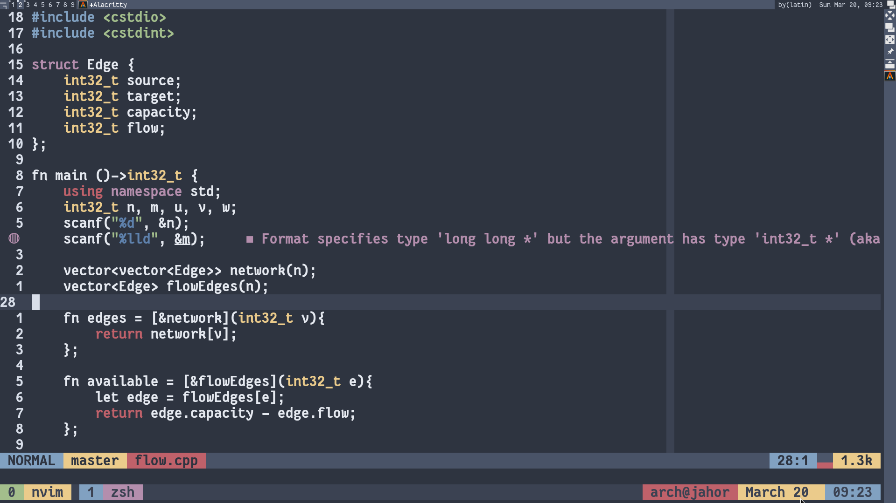

# .files
This repository contains dotfiles for my:
- [Editor][1]
- [WM][2]
- [Shell][3]
- [Terminal][5]

Feauturing several useful [scripts][4] and old configurations.

## 👀
- Colorscheme [base16-nord](https://github.com/RRethy/nvim-base16)
- Font [Fantasque Sans Mono](https://github.com/belluzj/fantasque-sans)

## Demo

[1]: config/.config/nvim
[2]: config/.config/awesome
[3]: shell/.zshrc
[4]: bin/bin
[5]: config/.config/alacritty